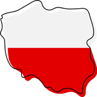

  

# KurwaCoach

**Learn Polish the hard way.**

## The Problem

Polish is one of the hardest European languages to learn — 7 grammatical cases, complex pronunciation, and very few cognates from English or Spanish. Most language apps treat all languages the same, but Polish needs a focused, no-nonsense approach with audio pronunciation from day one.

## The Solution

KurwaCoach is a gamified PWA for learning essential Polish phrases. Eight categories cover everything from basic greetings to street slang. Each round presents an English phrase with four Polish translation options. Get it right and hear the correct pronunciation spoken aloud. Streaks, confetti, and trophies keep you coming back.

## Who It's For

- Travelers planning a trip to Poland
- People with Polish partners, friends, or family
- Language enthusiasts who enjoy a challenge
- Anyone who wants to learn useful Polish phrases fast

## Categories

- 👋 Greetings — Hello, goodbye, how are you
- 🍽️ Restaurant — Ordering, paying, cheers
- 🛍️ Shopping — Prices, stores, payment
- 🚌 Transport — Directions, tickets, getting around
- 🚨 Emergency — Help, police, hospital, "I don't understand"
- 🔢 Numbers — 1 to 1000
- ☀️ Daily Life — Yes, no, time, love, family
- 🔥 Street Polish — Slang, casual phrases, real talk

## Key Features

- 100+ curated English → Polish phrases
- Audio pronunciation via Web Speech API (Polish voice)
- Pronunciation guide shown after each answer
- 4 multiple choice options per question
- Confetti on correct answers, super confetti on streaks
- 3-star system per category (0 errors = 3 stars)
- 10 trophies (First Steps, Polish Master, Kurwa King, Polyglot...)
- Challenge mode with random phrases from all categories
- Google sign-in for saving progress
- Unlimited play — no daily limits, no paywall
- Installable as a PWA on mobile

## Tech Stack

Next.js, Supabase (Postgres + Auth), Vercel, Cloudflare DNS, PWA

## Live

https://kurwacoach.franciscocucullu.com

---

## Author

**Francisco Cucullu** — Software engineer and indie developer building side projects from scratch.

- Website: [franciscocucullu.com](https://franciscocucullu.com)
- LinkedIn: [linkedin.com/in/franciscocucullu](https://linkedin.com/in/franciscocucullu)
- All apps: [franciscocucullu.com/apps](https://franciscocucullu.com/apps)
